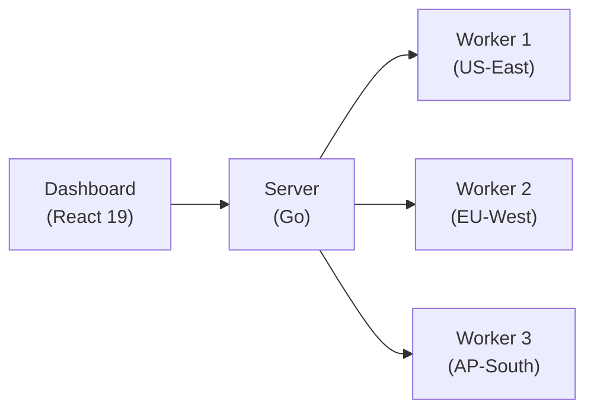
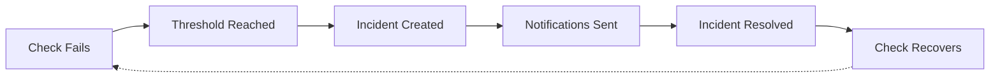
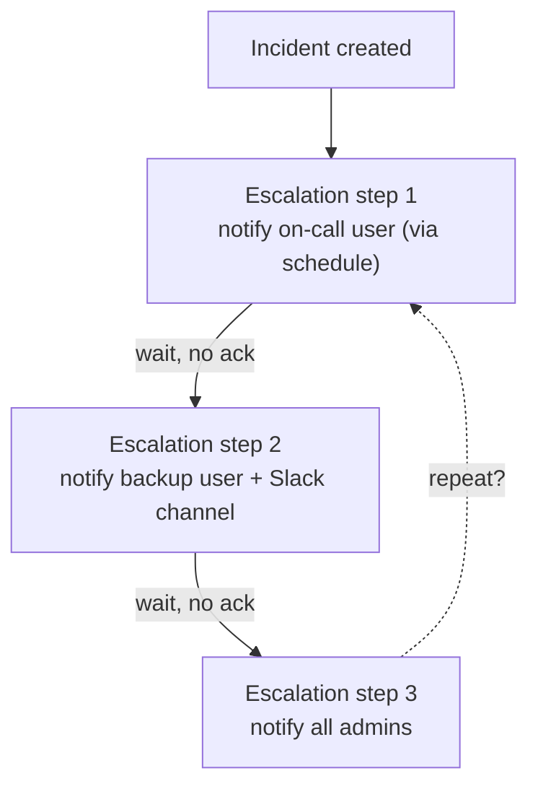
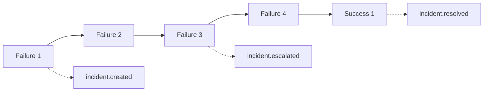

# Docs: replace the ASCII-art diagrams with rendered diagrams (Mermaid)

## Context

Three pages of the Docusaurus docs site (`web/docs/`, served at `/docs` on every
host) draw their flow/architecture diagrams as fenced ASCII art. They render as
monospaced text inside a code block — functional, but visually plain next to the
rest of the site, and they overflow awkwardly on narrow viewports. The user wants
them to "look nicer" as real diagrams. The reported pages:

1. **Architecture Overview** — `/docs/#architecture-overview`
   ([`web/docs/docs/intro.md:39-51`](../../web/docs/docs/intro.md#L39)) — a
   component graph: **Dashboard (React 19) → Server (Go) → 3 Workers
   (US-East / EU-West / AP-South)**.
2. **How Incidents Work** — `/docs/features/incidents`
   ([`web/docs/docs/features/incidents.md:12-16`](../../web/docs/docs/features/incidents.md#L12)) —
   the incident lifecycle loop: **Check Fails → Threshold Reached → Incident
   Created → Notifications Sent → Incident Resolved → Check Recovers**.
3. **How It Fits Together** — `/docs/features/on-call#how-it-fits-together`
   ([`web/docs/docs/features/on-call.md:55-68`](../../web/docs/docs/features/on-call.md#L55)) —
   the escalation cascade: **Incident created → step 1 (on-call) → step 2 (backup
   + Slack) → step 3 (all admins) → repeat**.

A fourth ASCII block lives on the same incidents page — the **Notification Flow
Example** ([`incidents.md:117-123`](../../web/docs/docs/features/incidents.md#L117),
"Failure 1 → created … Success 1 → resolved"). The user named only the three
above; this one is folded in as optional-for-consistency (see *Out of scope*).

### Current state of the toolchain

- Docusaurus **3.10.1** (`@docusaurus/core`, `@docusaurus/preset-classic` in
  [`web/docs/package.json`](../../web/docs/package.json)). This version ships
  first-class Mermaid support via `@docusaurus/theme-mermaid` — it is **not yet
  installed or configured**. [`docusaurus.config.ts`](../../web/docs/docusaurus.config.ts)
  has no `markdown` key, and `themes` is just `["docusaurus-theme-openapi-docs"]`
  ([`docusaurus.config.ts:91`](../../web/docs/docusaurus.config.ts#L91)).
- The site is built with `bun run build` (`docusaurus gen-api-docs all &&
  docusaurus build`) and embedded into the Go binary: `make build-docs` →
  `make copy-docs` copies the output into `server/internal/app/docsres/`. Dev
  server: `make dev-docs` (Docusaurus on `:3000`).
- `docusaurus-plugin-llms` generates `llms.txt` / per-page markdown from the docs
  ([`docusaurus.config.ts:59-73`](../../web/docs/docusaurus.config.ts#L59)).

### Other ASCII blocks (explicitly out of scope)

`rg` across `web/docs/docs/` turns up only one other multi-line ASCII block: a
**directory tree** in
[`installation/windows.md:117-122`](../../web/docs/docs/installation/windows.md#L117).
File trees read fine as monospace and don't map onto a flowchart — left as-is.
Everything else flagged (`status-pages.md`, `notifications.md`, `check-types.md`,
`authentication.md`) only uses inline `→` arrows in prose, not diagrams.

## Decision

**Adopt Mermaid via the official `@docusaurus/theme-mermaid`** and convert the
three named ASCII diagrams (plus the optional fourth) to `mermaid` code fences.

Rationale for Mermaid over hand-authored SVG (the user left the choice open):

- **First-class, near-zero-config in this exact Docusaurus version** — add the
  theme, flip `markdown.mermaid: true`, change the fence language. No build
  tooling, no asset pipeline.
- **Maintainable, diffable text source** that lives inline in the `.md` — future
  doc edits stay in the same file, reviewable as text, unlike a wall of `<path>`
  coordinates.
- **Auto-themes with the site's light/dark color mode** (the site has
  `respectPrefersColorScheme: true`), so we don't hand-maintain two color
  variants the way inline SVG would require (`currentColor` / CSS-var juggling).
- **Degrades sanely** in the llms.txt/markdown exports — a `mermaid` fence is
  still readable as a text block, much like today's ASCII.

Hand-authored SVG would give pixel-perfect control but costs far more to author
and maintain and needs manual dark-mode handling — not worth it for four small
box-and-arrow diagrams. If, after seeing the rendered Mermaid, the **Architecture
Overview** specifically wants a more bespoke look, a single inline SVG there is an
acceptable follow-up — but the default for all four is Mermaid.

## Goals

- The three named pages render real, themed diagrams instead of ASCII code blocks,
  in both **light and dark** mode, on the live docs (`/docs/...`).
- The diagrams preserve the **exact semantics** of today's ASCII (same nodes, same
  arrows, same loop/escalation/repeat relationships) — this is a visual upgrade,
  not a content rewrite.
- Diagrams are **responsive** — they scale/wrap within the content column on a
  ~390px mobile viewport with no horizontal overflow (the current ASCII overflows).
- `bun run build` (incl. `gen-api-docs`) and the `make build-docs` → `make
  copy-docs` embed still succeed; the embedded `/docs` serves the diagrams.
- `docusaurus-plugin-llms` still generates without error.

## Out of scope

- The **directory tree** in [`windows.md:117-122`](../../web/docs/docs/installation/windows.md#L117)
  and inline prose `→` arrows elsewhere — unchanged.
- The **Notification Flow Example** block
  ([`incidents.md:117-123`](../../web/docs/docs/features/incidents.md#L117)) is
  **optional**: convert it to a small `flowchart LR` for visual consistency with
  the lifecycle diagram on the same page *if it reads better*, otherwise leave the
  ASCII. Do not force it — a linear failure/notification sequence is borderline and
  may be just as clear as text. Skipping it is a valid outcome; note which you did.
- Any **content/wording** changes to the surrounding prose, the "Incident
  Lifecycle" numbered list, the states table, or the escalation explanation.
- The marketing site (`solidping-website` repo), the dashboards (`web/dash0`,
  `web/status0`, `web/dash`), and the OpenAPI reference pages.
- Introducing Mermaid anywhere beyond these diagrams (no broad docs sweep).

## Implementation

### 1. Wire up the Mermaid theme

In [`web/docs/package.json`](../../web/docs/package.json), add the theme pinned to
the Docusaurus version already in use:

```jsonc
"@docusaurus/theme-mermaid": "3.10.1"
```

Install with the docs site's package manager (the build uses **bun**): from
`web/docs/`, `bun install`. Commit the lockfile change.

In [`web/docs/docusaurus.config.ts`](../../web/docs/docusaurus.config.ts):

- Add a top-level `markdown` key (there is none today):
  ```ts
  markdown: { mermaid: true },
  ```
- Add the theme to the existing `themes` array
  ([line 91](../../web/docs/docusaurus.config.ts#L91)):
  ```ts
  themes: ["docusaurus-theme-openapi-docs", "@docusaurus/theme-mermaid"],
  ```
- Optionally pin the Mermaid color themes under `themeConfig` to match the site's
  clean look (defaults are acceptable; this just makes light/dark explicit):
  ```ts
  mermaid: { theme: { light: "neutral", dark: "dark" } },
  ```

### 2. Convert the diagrams

Replace each plain ```` ``` ```` fence with a ```` ```mermaid ```` fence. The
graphs below are a **concrete, ready-to-use starting point** — exact node shapes,
direction (`LR` vs `TD`), and label wording are the implementer's call as long as
the semantics match the original ASCII. Verify each renders before moving on.

**A. Architecture Overview** — [`intro.md:39-51`](../../web/docs/docs/intro.md#L39):

````markdown

````

**B. How Incidents Work** — [`incidents.md:12-16`](../../web/docs/docs/features/incidents.md#L12)
(closed lifecycle loop — recovery returns the check to a healthy state):

````markdown

````

**C. How It Fits Together** — [`on-call.md:55-68`](../../web/docs/docs/features/on-call.md#L55)
(escalation cascade with the "repeat?" loop as a dashed edge):

````markdown

````

**D. Notification Flow Example (optional)** —
[`incidents.md:117-123`](../../web/docs/docs/features/incidents.md#L117). Only if
it reads better than the ASCII:

````markdown

````

## Verification

1. **Dev render** — `make dev-docs` (Docusaurus on `:3000`) and open:
   - `/` → **Architecture Overview** renders diagram A.
   - `/features/incidents` → **How Incidents Work** renders diagram B (and, if
     done, the Notification Flow diagram D).
   - `/features/on-call#how-it-fits-together` → renders diagram C.
   Each shows a real diagram, **not** a code block, with all original nodes/arrows.
2. **Light + dark mode** — toggle the color-mode switch on each page; diagrams
   stay legible (text and lines contrast) in both.
3. **Mobile** — at ~390px width, each diagram fits the content column with **no
   horizontal scroll**; compare against the current ASCII overflow.
4. **Production build + embed** — from `web/docs/`, `bun run build` completes
   (incl. `gen-api-docs`); then `make build-docs && make copy-docs` succeed and
   `server/internal/app/docsres/` contains the rebuilt site. Optionally run the
   server and hit `/docs/features/incidents` to confirm the embedded copy renders
   the diagram.
5. **llms export** — confirm `docusaurus-plugin-llms` still generates without
   error and the `mermaid` fences appear as readable text blocks in the generated
   markdown/`llms.txt`.

## Tests

- No unit/E2E suite covers the docs site; verification is the build + manual
  render above. The key automated gate is that **`bun run build` stays green** —
  Mermaid syntax errors fail the Docusaurus build, so a clean build is the
  correctness signal for each diagram.
- Run `make lint` if it touches the docs workspace; otherwise the docs build is
  the check.

## Files referenced

- [`web/docs/docusaurus.config.ts`](../../web/docs/docusaurus.config.ts) — add
  `markdown: { mermaid: true }`, add `@docusaurus/theme-mermaid` to `themes`,
  optional `themeConfig.mermaid`.
- [`web/docs/package.json`](../../web/docs/package.json) — add
  `@docusaurus/theme-mermaid@3.10.1` (+ lockfile).
- [`web/docs/docs/intro.md`](../../web/docs/docs/intro.md#L39) — diagram A.
- [`web/docs/docs/features/incidents.md`](../../web/docs/docs/features/incidents.md#L12)
  — diagram B (and optional D at L117).
- [`web/docs/docs/features/on-call.md`](../../web/docs/docs/features/on-call.md#L55)
  — diagram C.
- [`Makefile`](../../Makefile) — `build-docs` / `copy-docs` / `dev-docs` targets
  (reference for build + embed; no change).

## Implementation Plan

1. **Enable Mermaid in Docusaurus**
   - Add `"@docusaurus/theme-mermaid": "3.10.1"` to `dependencies` in
     `web/docs/package.json` (matching the existing `@docusaurus/*` 3.10.1 pins).
   - In `web/docs/docusaurus.config.ts`: add top-level `markdown: { mermaid: true }`,
     append `"@docusaurus/theme-mermaid"` to the `themes` array, and add
     `mermaid: { theme: { light: "neutral", dark: "dark" } }` to `themeConfig`.
   - Run `cd web/docs && bun install` to update `bun.lock`.
   - Commit: package.json + lockfile + config.

2. **Convert the diagrams** (one `mermaid` fence per ASCII block, semantics preserved)
   - A. `web/docs/docs/intro.md` (Architecture Overview, ~L39-51) → `flowchart LR`
     Dashboard → Server → Worker 1/2/3.
   - B. `web/docs/docs/features/incidents.md` (How Incidents Work, ~L12-16) →
     `flowchart LR` closed lifecycle loop with a dashed Recovers ⇢ Fail edge.
   - C. `web/docs/docs/features/on-call.md` (How It Fits Together, ~L55-68) →
     `flowchart TD` escalation cascade with dashed "repeat?" edge back to step 1.
   - D. `web/docs/docs/features/incidents.md` (Notification Flow Example, ~L117-123) —
     optional; convert to a `flowchart LR` for consistency with B on the same page.
   - Commit the .md changes (granular).

3. **QA / verification**
   - `make build-docs` — primary gate (Mermaid syntax errors fail the build).
   - `make build-backend`, `make lint-back`, `make test` — confirm backend unaffected.
   - Grep to confirm no plain ASCII-diagram fences remain in the converted sections.
   - Commit: `chore: all checks passing for docs ascii to mermaid`.

4. **Archive** the spec to `specs/done/2026/06/` via `git mv` and commit.
