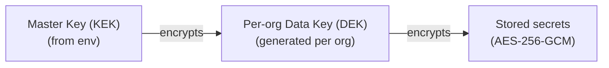

# Security & Encryption

SolidPing stores sensitive data two ways, depending on whether the server ever needs to read it back:

- **Encrypted at rest** — notification connection secrets, check credentials, integration tokens: AES-256-GCM under an out-of-band master key you provide.
- **Hashed at rest** — session refresh tokens, API tokens, invitation, registration and password-reset links: only a one-way digest is stored, so a stolen database yields nothing that can be replayed.

Encryption uses an **envelope scheme** anchored by an out-of-band master key that you provide.

## How It Works



1. You supply a 32-byte **master key** (the Key Encryption Key) via the environment.
2. SolidPing generates a random **data encryption key** per organization and stores it encrypted with the master key.
3. Individual secrets are encrypted with their organization's data key using **AES-256-GCM**.

Because the master key lives outside the database, a database dump alone never reveals plaintext secrets.

## Configuration

| Variable | Default | Description |
|----------|---------|-------------|
| `SP_ENCRYPTION_MASTER_KEY` | - | Base64-encoded 32-byte master key (KEK) |
| `SP_ENCRYPTION_MASTER_KEY_FILE` | - | Path to a file containing the base64 master key (wins over `SP_ENCRYPTION_MASTER_KEY` when both are set) |
| `SP_ENCRYPTION_AUTO_MIGRATE` | `true` | Encrypt any existing plaintext credentials on startup |

Generate a key with:

```bash
openssl rand -base64 32
```

```bash
SP_ENCRYPTION_MASTER_KEY=$(openssl rand -base64 32)
```

For Kubernetes, mount the key as a secret file and point `SP_ENCRYPTION_MASTER_KEY_FILE` at it.

:::warning Keep the master key safe
The master key is required to decrypt stored secrets. **Back it up** and keep it stable — losing it means losing access to every encrypted credential. Rotating it requires re-encrypting existing data.
:::

## Secrets Are Never Echoed Back

Secret fields (passwords, tokens, webhook secrets) are **never returned to the dashboard or API** after they're saved. Responses mask them with a placeholder and list which fields are secret, so the UI can show "a value is set" without exposing it. Secrets are decrypted server-side only when actually needed to perform a check or send a notification.

## Tokens Are Stored Hashed

Encryption protects secrets the server must read again. A credential that is only ever *presented* — the server only checks whether the value it was given is the right one — is stored differently: as a **SHA-256 hash of the value**, never as the value itself.

| Stored as a hash | What it authenticates |
|---|---|
| Session refresh token | keeping a signed-in session alive |
| API token (`pat_…`) | CLI and API access |
| MCP / OAuth refresh grant | long-lived OAuth access |
| Invitation link | joining an organization |
| Registration confirmation link | activating a new account |
| Password reset link | account recovery |
| SSO handoff code | the one-time exchange after an SSO round-trip |
| Status page kiosk token | TV / wallboard mode |
| Private-location agent enrollment token | pairing an agent |

**A database dump alone is useless against this.** There is no plaintext column to read: a backup, a replica or a SQL-injection read yields digests that cannot be replayed as a session, an API token or an invite link. That is the difference from the encryption above — encryption is reversible by anyone holding the master key, a hash is not reversible by anyone.

Lookups work the same way everywhere in the table: the value that was presented is hashed on the spot and matched against what is stored. For a single-use link the digest *is* the row's key, so the plaintext token from the link never lands on disk, and a digest on its own never authenticates anything.

**Why SHA-256 and not argon2id:** every value in that table is CSPRNG output of at least 192 bits — there is no dictionary to attack — and tokens are verified on hot paths where a memory-hard hash would cost a great deal and buy nothing. Passwords and OAuth client secrets are the opposite case (short, low-entropy, human-adjacent) and use argon2id — see [Password Hashing](/configuration/authentication#password-hashing).

**Upgrades are transparent.** Existing rows are hashed in place and the plaintext column is dropped in the same transaction, so sessions, API tokens and outstanding invitations keep working across an upgrade. Registration links still pending at upgrade time fail their confirmation once and must be requested again.

:::warning Downgrading deletes every stored token
An earlier version expects plaintext tokens, finds only hashes and degrades by deleting them: every user is signed out and every API token and OAuth grant is revoked. Upgrade again and sign back in.
:::

**Not everything can be hashed.** Notification connection secrets, webhook signing secrets, check credentials and integration tokens have to be re-read to be used — a hash cannot be turned back into a Slack token — so those are the encrypted ones described above. Hashing covers what the server only ever *verifies*.

## Optional, with a Plaintext Fallback

If no master key is configured, encryption is disabled and credentials are stored as-is (the original behavior). Setting a master key enables encryption and — with `SP_ENCRYPTION_AUTO_MIGRATE` — transparently migrates existing data. Configuring the master key is strongly recommended for any production deployment.

Token hashing has no such fallback and no configuration: it is not keyed off the master key, and it never stores a token in plaintext.

## Super-Admin Impersonation

A super admin can sign in as another user to see exactly what they see: **Server → Users**, then the eye icon on the user's row. It is meant for support and debugging, and it is built so it cannot become an account takeover:

- The session acts as the user, with **their** role in **their** organization. The admin's super-admin rights do not travel with it.
- It lasts **30 minutes** and has **no refresh token**. When it ends, or when the admin clicks **Exit** in the banner, the dashboard goes back to the admin's own session.
- The user's own sessions are untouched: nothing is added to their session list and they are not signed out.
- It **cannot** change the user's password, email, profile, 2FA or passkeys, create API tokens or sessions in their name, revoke their sessions, or start another impersonation. Those requests answer `403 IMPERSONATION_FORBIDDEN`.
- Super admins, the shared demo account and yourself cannot be impersonated. A user with 2FA can be: the admin's own sign-in is what gates it.
- Every start is recorded as `auth.impersonation_started` in the user's organization audit log, and every event written during the session carries `impersonated_by` with the admin's user ID.

The user is not notified by email. The audit log is the record.

To turn the feature off entirely:

| Variable | Default | Description |
|----------|---------|-------------|
| `SP_AUTH_IMPERSONATION_ENABLED` | `true` | When `false`, `POST /api/v1/system/users/:uid/impersonate` answers `404` |
