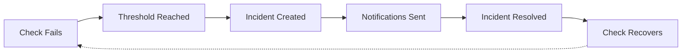
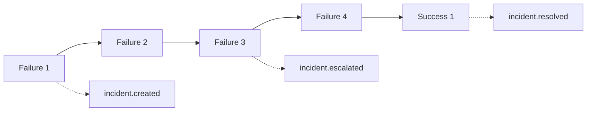

# Incident Management

SolidPing automatically creates, tracks, and resolves incidents based on check results. This page explains how the incident system works and how to configure it.

## How Incidents Work



### Incident Lifecycle

1. **Detection** - A check starts failing
2. **Threshold** - Consecutive failures reach `incident_threshold`
3. **Creation** - An incident is created and notifications are sent
4. **Escalation** - If failures reach `escalation_threshold`, escalation notifications are sent
5. **Recovery** - Check succeeds `recovery_threshold` consecutive times
6. **Resolution** - Incident is resolved and resolution notifications are sent

## Incident States

| State | Description |
|-------|-------------|
| `active` | Incident is ongoing, check is failing |
| `resolved` | Check has recovered, incident closed |

## Incident Number (`#42`)

Every incident also carries a short, **per-organization** number, GitHub-issue
style, exposed as `number` in the API. It is assigned when the incident opens,
ordered per organization, and **never reused** — a deleted incident keeps its
number, so `#42` identifies one incident forever.

It exists because nobody types a 36-character UUID into a chat on a phone. The
same `#42` is shown in the dashboard incident list and header, in Slack alert
headers, and in Telegram alerts — where it is what you type back as
`/ack #42` (see [Telegram](../configuration/telegram.md#in-chat-commands)).

## Group Incidents (Correlated Outages)

When several checks belong to the same check group, SolidPing correlates their failures into a **single group incident** — one alert per outage instead of one per check. This dramatically reduces noise when a shared dependency (a database, a region, an upstream provider) takes down many checks at once.

- The group incident tracks each member check individually (when it joined, how many times it failed, whether it is currently failing).
- The title reflects live counts, e.g. *"API Services: 2 of 5 down"*, and updates as members fail and recover.
- A recently-resolved group incident is **reopened** rather than recreated if another member fails within a short cooldown window, preventing incident thrashing on flapping dependencies.
- The group incident resolves only once **all** members have recovered.

## Acknowledging, Snoozing & Resolving {#acknowledge-snooze-resolve}

Incidents can be managed directly from the dashboard or API:

| Action | Effect |
|--------|--------|
| **Acknowledge** | Marks the incident as being handled and cancels pending escalation/notification jobs. Records who acknowledged it and when. |
| **Snooze** | Mutes notifications until a chosen time (`until` timestamp or a `duration`, max 7 days). Snoozing also implicitly acknowledges the incident. |
| **Unsnooze** | Clears the snooze and restores normal notification behavior. |
| **Resolve** | Manually closes the incident, cancels all pending notifications, and records a `manual` resolution. |

Auto-resolution (the check recovering on its own) records a `auto` resolution instead.

Acknowledging is not dashboard-only: Slack and Telegram alerts both carry an
**Acknowledge** button, and Telegram additionally accepts `/ack #42`. Every path
goes through the same service call, so all of them are idempotent and all of
them cancel the pending escalation.

## Comments

Responders can append free-text **comments** to an incident from the dashboard or API.
Each comment is added to the incident timeline as an append-only `incident.comment`
event authored by the calling user, so the running commentary of an outage — what was
tried, what was found, who took over — lives alongside the automated events.

```bash
curl -X POST http://localhost:4000/api/v1/orgs/default/incidents/{uid}/comments \
  -H "Authorization: Bearer $TOKEN" \
  -H "Content-Type: application/json" \
  -d '{"comment":"Restarted the upstream pool, watching recovery."}'
```

### Where a comment goes

A comment is not dashboard-only. It is fanned out through the same notification
pipeline the lifecycle events use, so everyone watching the incident on a chat
channel sees it:

- **Slack** posts it as a reply in the incident's existing thread.
- **Discord, Microsoft Teams, Mattermost, Google Chat, ntfy, Matrix, Pushover,
  web push, webhooks and email** deliver it in their normal message shape. Webhook
  receivers get an extra `data.comment` object (`text`, `authorName`, `source`)
  on `incident.comment` deliveries only.
- **Opsgenie** adds it as a note on the existing alert — never a new alert.
- **Twilio (SMS and voice) is excluded.** Paging someone's phone for every
  operator note is noise with a real bill attached.

Every delivery produces the usual `incident_notifications` audit row, so the
incident page's **Notifications** card shows who was told and whether it landed.

Two limits worth knowing:

- **A comment never echoes back to where it was written.** A reply captured from
  a Slack thread is not re-posted into that same workspace, or the bot would
  repeat the author's own words into the thread they just typed them in.
- **v1 reaches check-attached channels only.** People paged individually through
  an [escalation policy](/features/on-call) — a Telegram or SMS contact on a
  rotation — are not forwarded comments. Attach a channel to the check if the
  discussion needs to reach them.

### Commenting from chat

Both chat bots can add a comment without opening the dashboard:

- Slack: `/comment [#42] <text>` — see
  [Slack slash commands](/configuration/notifications#slash-commands).
- Telegram: `/comment [#42] <text>` — see
  [Telegram in-chat commands](/configuration/telegram#in-chat-commands).

In both cases the incident is resolved from an explicit `#42` first, then from
the unambiguous single active incident, and otherwise the bot lists the
candidates rather than guessing.

Slack additionally has a per-integration
[`comment_ingestion`](/configuration/notifications#capturing-thread-replies-comment_ingestion)
setting. It defaults to `explicit`: plain thread replies are **not** captured,
so only a deliberate `/comment` becomes permanent incident-timeline content.

## Maintenance Windows

During an active [maintenance window](/features/maintenance-windows), incident processing is suppressed for the affected checks — failures do not create incidents or fire notifications. Use this to silence alerts during planned deployments or upgrades.

## Thresholds

Configure thresholds per check to control when incidents are created:

### Incident Threshold

Number of consecutive failures before creating an incident.

```yaml
incident_threshold: 2  # Create incident after 2 consecutive failures
```

**Default:** `1` (incident created on first failure)

**Use cases:**
- Set to `1` for critical services that need immediate alerting
- Set to `2-3` for services with occasional transient failures
- Set higher for non-critical checks to reduce noise

### Escalation Threshold

Number of consecutive failures before escalating the incident.

```yaml
escalation_threshold: 5  # Escalate after 5 consecutive failures
```

**Default:** `3`

Escalation sends additional notifications to alert that an issue has persisted. For structured paging — rotation schedules, multi-step escalation, and "page the next person if nobody acknowledges" — see [On-Call & Escalation](/features/on-call).

### Recovery Threshold

Number of consecutive successes before resolving an incident.

```yaml
recovery_threshold: 2  # Resolve after 2 consecutive successes
```

**Default:** `1`

**Use cases:**
- Set to `1` for quick resolution notifications
- Set to `2-3` to avoid false recoveries during flapping

## Notification Events

| Event | When | Description |
|-------|------|-------------|
| `incident.created` | Threshold reached | Initial alert |
| `incident.escalated` | Escalation threshold | Prolonged outage |
| `incident.resolved` | Recovery threshold | Service recovered |

### Notification Flow Example

With default thresholds (1, 3, 1):



## Incident Details

Each incident includes:

- **UID** - Unique identifier
- **Check** - Associated check details
- **Status** - Current state (active/resolved)
- **Started At** - When the incident was created
- **Resolved At** - When the incident was resolved (if applicable)
- **Failure Count** - Number of consecutive failures
- **Events** - Timeline of state changes

## Events

SolidPing logs events for audit and debugging:

| Event Type | Description |
|------------|-------------|
| `check.created` | New check added |
| `check.updated` | Check configuration changed |
| `check.deleted` | Check removed |
| `incident.created` | New incident |
| `incident.escalated` | Incident escalated |
| `incident.resolved` | Incident resolved |
| `notification.queued` | Notification scheduled |
| `notification.sent` | Notification delivered |
| `notification.failed` | Notification failed |

## API Endpoints

### List Incidents

```bash
GET /api/v1/orgs/{org}/incidents
```

Query parameters:
- `status` - Filter by status: `active`, `resolved`
- `check_uid` - Filter by check
- `limit` - Number of results
- `offset` - Pagination offset

### Get Incident Details

```bash
GET /api/v1/orgs/{org}/incidents/{uid}
```

### Get Incident Events

```bash
GET /api/v1/orgs/{org}/incidents/{uid}/events
```

## Best Practices

### Reduce Alert Fatigue

1. **Tune thresholds** - Set `incident_threshold: 2` for checks with occasional transient failures
2. **Use recovery threshold** - Set `recovery_threshold: 2` to avoid alerts during flapping
3. **Group related checks** - Use tags or naming conventions to organize checks

### Effective Escalation

1. **Set meaningful escalation thresholds** - 3-5 failures typically indicates a real issue
2. **Configure escalation notifications** - Route escalations to different channels (e.g., PagerDuty)
3. **Review escalation frequency** - If too many escalations, investigate root causes

### Incident Response

1. **Acknowledge incidents** - Mark incidents as acknowledged to prevent duplicate alerts
2. **Document resolutions** - Add notes about what caused the incident and how it was resolved
3. **Review incident history** - Use incident data to identify recurring issues

## Example Configuration

```yaml
checks:
  - name: Production API
    url: https://api.example.com/health
    period: 30s
    timeout: 10s
    incident_threshold: 2      # Alert after 2 failures
    escalation_threshold: 6    # Escalate after 3 minutes of downtime
    recovery_threshold: 2      # Require 2 successes to resolve

  - name: Background Worker
    url: tcp://worker.internal:8080
    period: 60s
    timeout: 30s
    incident_threshold: 3      # More tolerance for worker
    escalation_threshold: 10   # Escalate after 10 minutes
    recovery_threshold: 1      # Quick resolution is fine
```

## Metrics

SolidPing tracks incident metrics:

- **MTTR** (Mean Time To Recovery) - Average time to resolve incidents
- **MTTA** (Mean Time To Acknowledge) - Average time to acknowledge
- **Incident Count** - Number of incidents over time
- **Availability** - Uptime percentage based on incident duration
