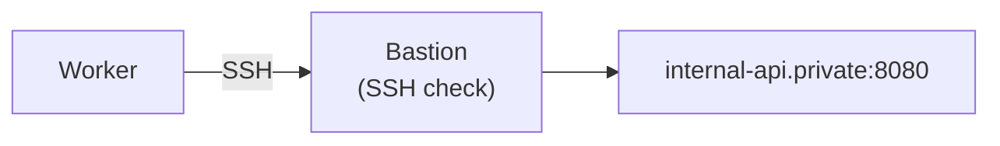

# SSH tunnels

Probe services that are only reachable through a **bastion host** — private
networks, VPC-internal services, a database behind a jump box — with nothing new
to deploy. If you already run SSH, you already have everything you need.

A tunnel-capable check carries a reference to an **SSH check** in the same
organization. At each execution the worker opens a fresh SSH session to that
bastion and dials the check's target through it.

## When to use this vs. a private location

Both reach things the cloud workers cannot:

| | SSH tunnel | [Private location / agent](./private-locations.md) |
|---|---|---|
| Setup | Point at an existing SSH check | Deploy and enroll an agent |
| Needs inbound access | Yes — the bastion's SSH port | No — the agent dials out |
| Protocols | Any TCP-based check (databases, brokers, `http`, `tcp`, …) | Every check type, incl. ICMP/UDP |

Reach for the tunnel when a bastion already exists; reach for an agent when
nothing is reachable from outside at all.

## Setting one up

1. **Create an SSH check for the bastion.** Give it a `username` plus a
   `password` or `private_key`, and — required — its `expected_fingerprint`.
2. **On the check you want to tunnel**, open **Advanced → Run through SSH
   tunnel** and pick the SSH check.

The bastion is now monitored in its own right, and it is the single home for
its credentials: they are stored encrypted at rest on that one check, and there
is no separate tunnel resource to keep in sync.

## Supported check types

Every TCP-based check type can run through a tunnel — the classic bastion use
cases (a database or message broker on a private network) are all covered:

- **Web & network:** `http`, `tcp`, `ssl`, `websocket`, `grpc`
- **Databases:** `postgresql`, `mysql`, `mssql`, `oracle`, `clickhouse`, `redis`, `mongodb`
- **Message brokers:** `rabbitmq`, `kafka`, `mqtt`
- **Mail:** `smtp`, `imap`, `pop3`
- **File transfer:** `ftp`

The dashboard's selector appears only on types that support it (the API reports
this as `supportsTunnel` on `/api/v1/orgs/{org}/check-types`), so the option
shows up automatically wherever it applies.

UDP- and ICMP-based types (`icmp`, `udp`, `ntp`, `snmp`, `dns`, `dnsbl`, `sip`,
`a2s`) cannot tunnel: an SSH `direct-tcpip` forward carries **TCP only**. For
those, use a [private location / agent](./private-locations.md) instead.

:::note FTP passive mode
For `ftp`, both the control connection and passive-mode (PASV) data connections
are dialed through the bastion. One caveat: a tunneled **implicit-TLS** FTPS
check connects in plaintext through the tunnel — use explicit TLS (`AUTH TLS`)
if you need the control channel encrypted end to end.
:::

## Host-key verification is required

An SSH check may be used as a tunnel **only if its `expected_fingerprint` is
set**, and the tunnel dial verifies the bastion's host key against it strictly.
The tunnel carries your probe's traffic, so an unverified bastion is a silent
man-in-the-middle. SSH checks with no fingerprint stay selectable-but-disabled
in the picker, with a hint.

A plain SSH check without a fingerprint keeps working as a check — the
requirement applies only when it is used as a tunnel.

## Names are resolved by the bastion

The target hostname is sent through the tunnel **verbatim** and resolved on the
bastion, not by the worker. That is the point: `internal-api.private` means
nothing to a cloud worker's resolver, but resolves correctly on the far side —
so private DNS names work exactly as they do when you SSH in yourself.

## Tunnels from a private location (deported agent)

A check that runs in a [private location / agent](./private-locations.md) can
tunnel too — the classic case is a service reachable only through a jump box
**inside** that same private network. For that to work, the referenced SSH check
must itself be **allocated to the same private region**:

- **The SSH check must cover every private region the tunneled check runs in.**
  If your check runs in `@paris`, its bastion SSH check must also run in
  `@paris`. That is what guarantees the bastion's credentials are already sealed
  to that region's agents — dispatch ships the **sealed** credential envelope to
  the agent verbatim, and the agent (a recipient by construction) unseals it with
  its own key. Nothing is ever re-encrypted, and no credential ever reaches an
  agent of a region the SSH check is not allocated to.
- **A bastion monitored only from private regions can't serve a cloud check.**
  An SSH check allocated exclusively to private regions stores its credentials
  *sealed-only* — the server itself can't read them, only the region's agents
  can. Such a bastion can only be tunneled through by checks that also run
  exclusively in those private regions. To also tunnel from a cloud region, give
  the SSH check a cloud region as well.

The dashboard's tunnel picker enforces the first rule up front: an SSH check that
isn't allocated to a private region your check runs in appears **disabled**, with
the reason (`not in region @paris`). Editing a check's regions can likewise be
rejected if it would move the check somewhere its tunnel's SSH check doesn't
cover — and, from the other side, narrowing an in-use bastion's regions is
refused while dependents still rely on it.

## Latency: `tunnel_setup_ms`

Establishing the SSH session is **not** counted in the check's response time. It
is recorded as its own metric, `tunnel_setup_ms`, in the result's metrics.
Without that split, every tunneled check's latency graph would be a picture of
SSH handshakes rather than of the service you are monitoring.

Each execution dials its own session, so expect a `tunnel_setup_ms` on every
result. (Connection pooling is a future improvement.)

## Failure classification

A failure of the **tunnel** is reported distinctly from a failure of the
**target**:

| What happened | Result |
|---|---|
| Bastion unreachable, auth failed, host key mismatch, forward refused | `error`, output `tunnel failed: …` plus a `tunnel_failed: true` marker. The target is never probed. |
| Tunnel fine, target refused / timed out / returned the wrong thing | The check's normal `down` / `timeout` result |

So a broken bastion reads as a broken bastion, not as ten services going down at
once. (Automatically suppressing dependents' alerts when the bastion is down is
a planned follow-up built on this distinction.)

### Error catalog

When a check runs on a **private-location agent**, two extra failure modes carry
a `tunnel_failed: true` marker in the result output:

| Message | Cause | Fix |
|---|---|---|
| `tunnel failed: ssh tunnel check … no longer exists in this organization` | The bastion SSH check was deleted after this check was configured. | Recreate the bastion or detach the tunnel. |
| `tunnel failed: ssh tunnel check … is not allocated to region @paris` | The bastion was moved out of the agent's region since the check was validated. | Re-allocate the SSH check to that region. |
| `tunnel failed: ssh tunnel check … must set expected_fingerprint …` | The bastion's fingerprint was cleared. | Set `expected_fingerprint` on the SSH check again. |
| `tunnel failed: ssh tunnel credentials not sealed for this agent …` | The agent isn't a recipient of the bastion's sealed credentials (region drift, or credentials never re-sealed after the agent enrolled). | Re-save the SSH check's credentials so they seal to the current agents. |
| `tunnel failed: ssh tunnel: not available on this agent …` | The agent received a tunneled job with no tunnel block (version skew). | Ensure the SSH check is allocated to the agent's region; upgrade the agent. |

These are written as an explicit **error result** — the job is never dispatched
without its tunnel and never silently skipped, so the check's history always
explains why it isn't running.

## Rules and limits

- The referenced check must be **in the same organization**, must be an **`ssh`**
  check, and must set **`expected_fingerprint`**.
- **No chaining** — the referenced SSH check may not itself be tunneled.
  Multi-hop bastions are a possible follow-up.
- **Deleting a bastion that other checks tunnel through is refused** (`409`),
  listing the dependents. Detach them first. The SSH check's detail page shows
  the same list.
- The dependency is **config-level, not runtime-level**: disabling or pausing
  the SSH check does **not** stop the checks that tunnel through it.
- **Regions must line up for private locations.** For a check running on a
  deported agent, the SSH check must be allocated to that private region too (see
  [Tunnels from a private location](#tunnels-from-a-private-location-deported-agent)).
  For checks running only in cloud regions, the bastion's regions are
  independent — as long as its credentials are server-resolvable (not
  sealed-only).
