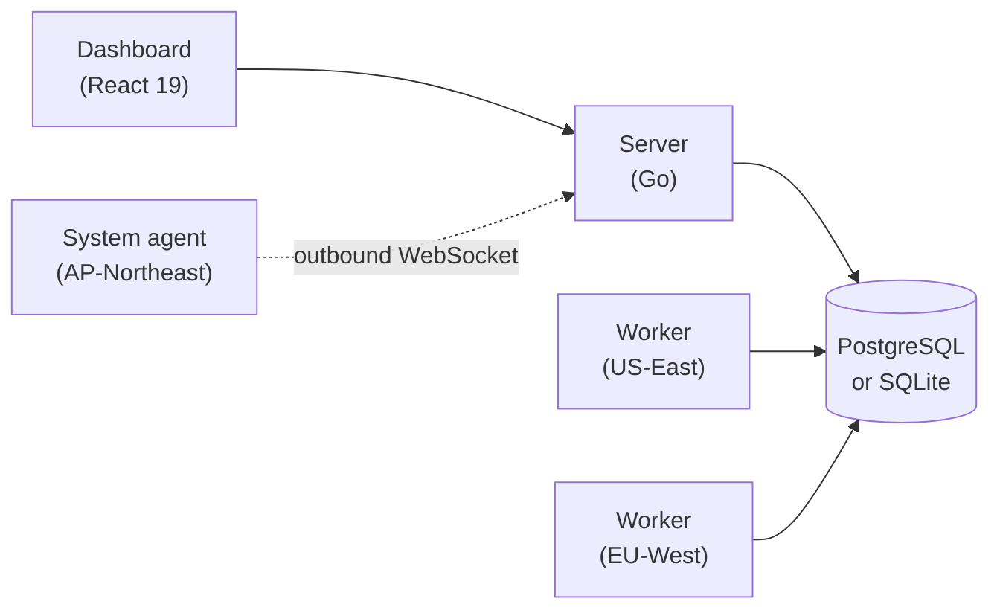

# Introduction to SolidPing

SolidPing is a **distributed monitoring platform** designed for checking the availability and performance of services across multiple protocols. It's built for teams who need reliable, self-hosted monitoring with minimal infrastructure requirements.

## Key Features

- **39 Check Types** - HTTP/HTTPS, TCP, UDP, ICMP, DNS, DNSBL, NTP, SSL, Domain, WebSocket, databases (PostgreSQL, MySQL, Redis, MongoDB, MSSQL, Oracle, ClickHouse), email (SMTP, IMAP, POP3, and passive JMAP inbox), messaging (gRPC, Kafka, RabbitMQ, MQTT), SSH, RDP, FTP, SFTP, SNMP, Docker, Kubernetes, SIP, game servers (A2S, Minecraft), Freebox lines, and more
- **Distributed Workers & System Agents** - Execute checks from multiple locations and regions with lease-based job distribution; system agents cover regions over an outbound-only WebSocket, without any database exposure
- **Multi-Tenant Architecture** - Organization-scoped data isolation with role-based access control and TOTP two-factor authentication
- **Low Resource Footprint** - Single binary with PostgreSQL or SQLite as the only dependency
- **Sub-Minute Checks** - Run checks as frequently as every 5 seconds for critical services
- **Flexible Notifications** - Slack, Discord, Email, Webhooks, Google Chat, Mattermost, ntfy, Matrix, PagerDuty, Pushover, and Web Push
- **Smart Incident Management** - Adaptive thresholds, cooldown, group-incident correlation, acknowledgment, snooze, and per-incident comments
- **On-Call & Escalation** - Rotation schedules with overrides and iCal feeds, plus multi-step escalation policies
- **Maintenance Windows** - One-time or recurring suppression of alerts during planned work
- **Public Status Pages** - Embeddable status dashboards with email subscribers and an Atom feed
- **JavaScript Scripting** - Custom monitoring logic for complex multi-step workflows
- **Credentials Encryption at Rest** - Envelope encryption with an out-of-band master key; secrets are never echoed back to the dashboard
- **Single Sign-On** - Sign in with Google, GitHub, GitLab, Microsoft, Slack, or Discord, or plug in your own provider over generic OIDC, SAML, or LDAP
- **MCP Server** - Expose checks, incidents, and status pages to AI assistants over the Model Context Protocol
- **Observability** - Sentry error tracking, Prometheus metrics, OpenTelemetry support
- **CLI Client** - Manage checks, incidents, and results from the terminal with the `sp` binary
- **Internationalized Dashboard** - Available in English, French, German, and Spanish

## Architecture Overview

SolidPing consists of four main components:

1. **Server** - The main application that handles the API, dashboard, and job scheduling
2. **Workers** - Check runners that connect **directly to the database** and claim jobs with `SELECT FOR UPDATE SKIP LOCKED` for lease-based distribution — reliable failover, no duplicate checks. The right fit when the runner lives next to PostgreSQL (same cluster or trusted network).
3. **System agents** - Check runners that serve the **same regions as workers** but hold **no database credentials at all**. An agent dials *out* to the server over a single outbound WebSocket and claims jobs through it, so you can run a region from another datacenter, cloud provider, or continent without exposing PostgreSQL there. Regions don't change — an agent is a drop-in replacement for a worker in any region.
4. **Database** - PostgreSQL (recommended for production) or SQLite (for simple setups)



### System agents: an extra layer of security

System agents trade the direct database connection for a hardened, minimal protocol:

- **No inbound ports, no database access** — the agent only dials out; it has no HTTP server, no migrations, and no way to query your data.
- **Keys are generated on the agent, never by the server.** At enrollment (a one-time `spe_` token, seeded per region via `SP_SYSTEM_AGENT_ENROLLMENT_TOKENS` on the server) the agent creates its own Ed25519 identity locally and sends only the public key. After that there is no long-lived bearer credential to steal: every reconnection is signed, with timestamp and nonce checks to block replay.
- **Checks-only by construction.** The protocol is exactly *claim jobs / submit results*. The server scopes every claim server-side, and check credentials are re-encrypted (age/X25519) to the claiming agent at claim time — a compromised agent can see only the jobs it was handed.

It's the same binary: run it with `SP_NODE_ROLE=agent`, point `SP_AGENT_SERVER_URL` at your server, and pass the region's enrollment token. The same transport also powers customer-run [private locations](/features/private-locations), which monitor networks the platform can't reach at all.

## Quick Start

The fastest way to get started is with Docker:

```bash
docker run -p 4000:4000 -v solidping-data:/data \
  -e SP_DB_TYPE=sqlite -e SP_DB_DIR=/data \
  ghcr.io/fclairamb/solidping:latest
```

Then open [http://localhost:4000](http://localhost:4000) in your browser.

**Default credentials:**
- Email: `admin@solidping.io`
- Password: `solidpass`
- Organization: `default`

:::warning First login sets a new password
That password is published in the SolidPing repository, so it is only good for
exactly one login. SolidPing takes you straight to a "set a new password"
screen, and the account can do nothing else until you complete it.
:::

## Next Steps

- [Docker Installation](/installation/docker) - Recommended for most users
- [Configuration Guide](/configuration) - Environment variables and settings
- [Check Types](/features/check-types) - All 38 supported protocols and options
- [Notifications](/configuration/notifications) - Set up alerting channels
- [On-Call & Escalation](/features/on-call) - Rotation schedules and escalation policies
- [Maintenance Windows](/features/maintenance-windows) - Suppress alerts during planned work
- [MCP Server](/features/mcp) - Connect AI assistants to your monitoring data
- [CLI Client](/cli) - Drive SolidPing from the terminal
