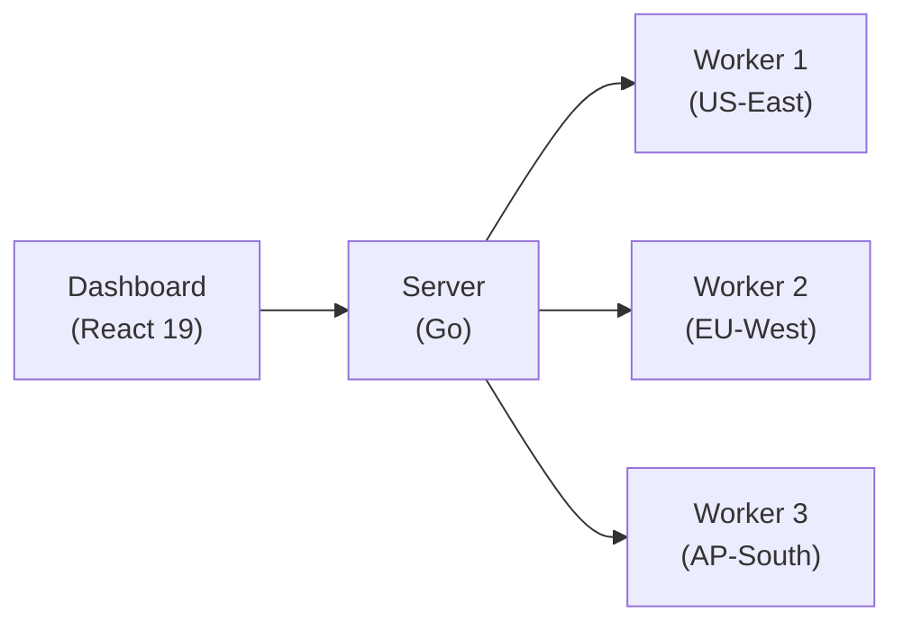

# Introduction to SolidPing

SolidPing is a **distributed monitoring platform** designed for checking the availability and performance of services across multiple protocols. It's built for teams who need reliable, self-hosted monitoring with minimal infrastructure requirements.

## Key Features

- **39 Check Types** - HTTP/HTTPS, TCP, UDP, ICMP, DNS, DNSBL, NTP, SSL, Domain, WebSocket, databases (PostgreSQL, MySQL, Redis, MongoDB, MSSQL, Oracle, ClickHouse), email (SMTP, IMAP, POP3, and passive JMAP inbox), messaging (gRPC, Kafka, RabbitMQ, MQTT), SSH, RDP, FTP, SFTP, SNMP, Docker, Kubernetes, SIP, game servers (A2S, Minecraft), Freebox lines, and more
- **Distributed Workers** - Execute checks from multiple locations and regions with lease-based job distribution
- **Multi-Tenant Architecture** - Organization-scoped data isolation with role-based access control and TOTP two-factor authentication
- **Low Resource Footprint** - Single binary with PostgreSQL or SQLite as the only dependency
- **Sub-Minute Checks** - Run checks as frequently as every 5 seconds for critical services
- **Flexible Notifications** - Slack, Discord, Email, Webhooks, Google Chat, Mattermost, ntfy, Opsgenie, Pushover, and Web Push
- **Smart Incident Management** - Adaptive thresholds, cooldown, group-incident correlation, acknowledgment, snooze, and per-incident comments
- **On-Call & Escalation** - Rotation schedules with overrides and iCal feeds, plus multi-step escalation policies
- **Maintenance Windows** - One-time or recurring suppression of alerts during planned work
- **Public Status Pages** - Embeddable status dashboards with email subscribers and an Atom feed
- **JavaScript Scripting** - Custom monitoring logic for complex multi-step workflows
- **Credentials Encryption at Rest** - Envelope encryption with an out-of-band master key; secrets are never echoed back to the dashboard
- **Single Sign-On** - Sign in with Google, GitHub, GitLab, Microsoft, Slack, or Discord, or plug in your own provider over generic OIDC, SAML, or LDAP
- **MCP Server** - Expose checks, incidents, and status pages to AI assistants over the Model Context Protocol
- **Observability** - Sentry error tracking, Prometheus metrics, OpenTelemetry support
- **CLI Client** - Manage checks, incidents, and results from the terminal with the `sp` binary
- **Internationalized Dashboard** - Available in English, French, German, and Spanish

## Architecture Overview

SolidPing consists of three main components:

1. **Server** - The main application that handles the API, dashboard, and job scheduling
2. **Workers** - Distributed agents that execute health checks from different locations
3. **Database** - PostgreSQL (recommended for production) or SQLite (for simple setups)



Workers use PostgreSQL's `SELECT FOR UPDATE SKIP LOCKED` for lease-based job distribution, ensuring reliable failover and no duplicate checks.

## Quick Start

The fastest way to get started is with Docker:

```bash
docker run -p 4000:4000 -v solidping-data:/data \
  -e SP_DB_TYPE=sqlite -e SP_DB_DIR=/data \
  ghcr.io/fclairamb/solidping:latest
```

Then open [http://localhost:4000](http://localhost:4000) in your browser.

**Default credentials:**
- Email: `admin@solidping.com`
- Password: `solidpass`
- Organization: `default`

## Next Steps

- [Docker Installation](/installation/docker) - Recommended for most users
- [Configuration Guide](/configuration) - Environment variables and settings
- [Check Types](/features/check-types) - All 38 supported protocols and options
- [Notifications](/configuration/notifications) - Set up alerting channels
- [On-Call & Escalation](/features/on-call) - Rotation schedules and escalation policies
- [Maintenance Windows](/features/maintenance-windows) - Suppress alerts during planned work
- [MCP Server](/features/mcp) - Connect AI assistants to your monitoring data
- [CLI Client](/cli) - Drive SolidPing from the terminal
